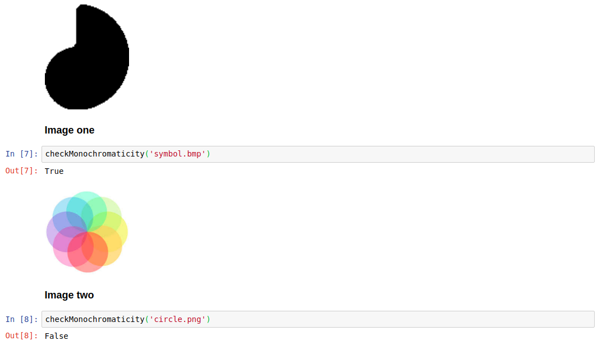

# Check Image Monochromaticity

monochromatic or not monochromatic, that's the question. 
This is the snippet if you need to check the monochromaticity of any image file.

## Inspiration

We needed to make this validation at project I've worked on.

## How does it look like?

## Dependencies

PIL

## Further work

I'm not sure if it works for all possible image formats.

If you use it and have any kind of problem, please let me know.
